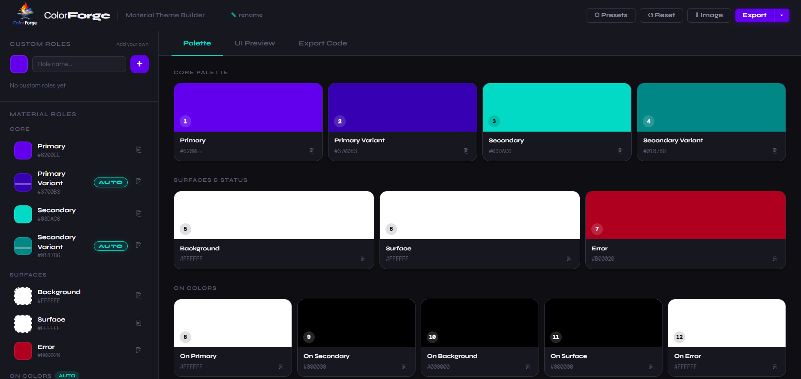

<div align="center">


### **Material Theme Builder — for the Web**
*Forge raw colors into complete, production-ready UI systems*

<br/>

[](LICENSE)


<br/>

> **Color Forge** is a free, open-source, zero-dependency web tool that transforms raw colors
> into structured Material Design theme systems — live in your browser, no signup required.

<br/>



<br/>

[**🚀 Live Demo**](https://nobodydebunny.github.io/ColorForge/) · [**📖 Docs**](#how-it-works) · [**🐛 Report Bug**](issues) · [**✨ Request Feature**](issues)

<br/>

</div>

---

## ✦ What is Color Forge?

Most color tools stop at the swatch. **Color Forge goes further.**

You pick a Primary color. Color Forge builds the entire Material Design system around it — variants, on-colors, surfaces, error states — and instantly shows you what your app will actually look like. Then it exports everything in the format your codebase already uses.

It's the Material Theme Builder from Figma, rebuilt for the open web.

---

## ✦ Features

### 🎨 Full Material Color System
Define all 12 core Material Design color roles — no guesswork, no missing tokens.

| Role | Description |
|------|-------------|
| `Primary` | Your brand's dominant color |
| `Primary Variant` | Darker shade — auto-calculated or manual |
| `Secondary` | Accent & interactive elements |
| `Secondary Variant` | Deeper secondary — auto or manual |
| `Background` | Page-level backgrounds |
| `Surface` | Card and container surfaces |
| `Error` | Destructive actions and alerts |
| `On Primary / Secondary / Background / Surface / Error` | Auto-calculated contrast-safe text colors |

### ⚡ Smart Auto-Variant
No more guessing how dark your variant should be. Toggle **Auto** on any variant and Color Forge calculates it from your base color in real time. Override it anytime — just touch the picker and Auto disables gracefully.

```
Primary  #6200EE  →  Primary Variant  #3900BB  (auto, 58% brightness)
Secondary #03DAC6  →  Secondary Variant  #01806B  (auto, 58% brightness)
```

### 🖥️ Live UI Preview
See your entire theme rendered inside a phone mockup — **instantly**, as you drag color pickers.

- App bar with your Primary color
- Cards and surfaces using Surface + On Surface
- Input fields with Primary borders
- Buttons (filled + outlined)
- Chips with all 4 variants
- Error banners
- Bottom navigation
- Floating Action Button

### ♿ WCAG Contrast Checker
Every color pair is automatically checked against WCAG accessibility guidelines.

- **AAA** ≥ 7:1 contrast ratio
- **AA** ≥ 4.5:1 contrast ratio
- **Fail** — shown clearly so you can fix it before it ships

### 🎛️ Custom Color Roles
Beyond Material's standard roles, add your own — `Brand Blue`, `Highlight`, `Warning` — and they flow into every export format automatically.

### 🌈 Gradient Builder
Build CSS gradients from your palette colors with direction controls (→ ↘ ↓ radial). One click copies the CSS.

### 📦 Export in 4 Formats

<table>
<tr>
<td>

**CSS Variables**
```css
:root {
  --primary: #6200EE;
  --primary-variant: #3700B3;
  --secondary: #03DAC6;
  --on-primary: #FFFFFF;
}
```

</td>
<td>

**JSON**
```json
{
  "colors": {
    "primary": "#6200EE",
    "secondary": "#03DAC6",
    "onPrimary": "#FFFFFF"
  }
}
```

</td>
</tr>
<tr>
<td>

**Android XML**
```xml
<resources>
  <color name="primary">#6200EE</color>
  <color name="on_primary">#FFFFFF</color>
</resources>
```

</td>
<td>

**Tailwind Config**
```js
module.exports = {
  theme: {
    extend: {
      colors: {
        'primary': '#6200EE',
      }
    }
  }
}
```

</td>
</tr>
</table>

### 🖼️ Palette Image Export
Export your entire theme as a PNG — numbered, labeled, ready for design specs, Notion docs, or Figma annotations.

### 🎯 6 Built-in Presets
Jump-start with handcrafted presets:

| Preset | Primary | Secondary | Mood |
|--------|---------|-----------|------|
| Material Default | `#6200EE` | `#03DAC6` | Classic Google |
| Ocean Blue | `#0077B6` | `#00B4D8` | Clean & corporate |
| Amber Dark | `#FFAB00` | `#69F0AE` | Dark mode energy |
| Rose Gold | `#C2185B` | `#FF8A65` | Warm & premium |
| Forest | `#2E7D32` | `#8BC34A` | Calm & natural |
| Indigo Night | `#7C4DFF` | `#FF6D00` | Bold & electric |

---

## ✦ How It Works

```
┌─────────────────────────────────────────────────────────────────┐
│                                                                   │
│   You pick     →   Color Forge    →   Complete theme system      │
│   a color          calculates         ready to ship              │
│                                                                   │
│   #6200EE      →   variants       →   CSS / JSON / XML / JS     │
│                    on-colors                                      │
│                    contrast        →   Live UI preview           │
│                    gradients                                      │
│                                   →   Exportable PNG             │
│                                                                   │
└─────────────────────────────────────────────────────────────────┘
```

---

## ✦ Try It — No Install Needed

**Color Forge is hosted live. Just open the link and start building.**

> 🔗 **[color-forge.yourusername.github.io](https://nobodydebunny.github.io/ColorForge/)**

No signup. No download. No setup. Works on any modern browser.

---

## ✦ Self-Host or Fork

Want your own copy or want to contribute? It's 3 files.

```bash
git clone https://github.com/yourusername/color-forge.git
cd color-forge
open index.html   # opens directly — no server needed
```

Or deploy your own fork to GitHub Pages in 60 seconds:

1. Fork this repo
2. Go to **Settings → Pages**
3. Set source to `main` branch, `/ (root)`
4. Done — live at `https://yourusername.github.io/color-forge`

---

## ✦ File Structure

```
color-forge/
├── index.html      # App structure & all UI components
├── style.css       # Complete design system (dark theme, Syne font)
├── app.js          # All logic: color math, rendering, export, events
└── README.md
```

**Zero dependencies. Zero frameworks. Zero build tools.**
Pure HTML + CSS + JavaScript. Fork it, host it, ship it.

---

## ✦ Color Math

Color Forge uses **WCAG 2.1 relative luminance** for all contrast calculations:

```javascript
// Relative luminance
L = 0.2126R + 0.7152G + 0.0722B

// Contrast ratio
ratio = (L1 + 0.05) / (L2 + 0.05)

// Auto On-color
onColor = luminance(hex) > 0.35 ? '#000000' : '#FFFFFF'

// Auto variant (58% brightness)
variant = rgb.map(v => Math.round(v * 0.58))
```

---

## ✦ Roadmap

- [ ] Dark mode theme generation
- [ ] Material You / Dynamic Color support
- [ ] Tonal palette generation (full 10-step scale)
- [ ] Import from existing CSS / Figma tokens
- [ ] Color harmony suggestions (complementary, triadic, split)
- [ ] Saved themes (localStorage)
- [ ] Share theme via URL

---

## ✦ Contributing

Contributions are welcome. Please open an issue before submitting a PR for large changes.

```bash
git clone https://github.com/yourusername/color-forge.git
cd color-forge
# No npm install needed — just open index.html
```

---

## ✦ License

GNU General Public License v3.0 — you're free to use, study, modify, and distribute this software, but any derivative work must also remain open-source under the same license.

See [`LICENSE`](LICENSE) for the full terms.

---

<div align="center">

**Built with obsession by a designer who got tired of switching tools.**

*If Color Forge saved you time, give it a ⭐ — it means everything.*

<br/>

[](https://github.com/yourusername/color-forge)

</div>
